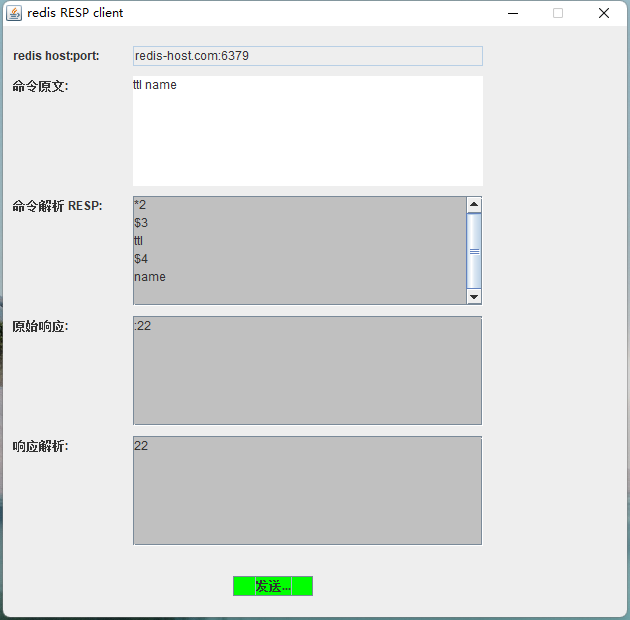

# 客户端最终效果图



# RESP protocol spec

> Redis serialization protocol (RESP) specification


`Redis` `client` 与 `server` 之间采用的是 `RESP` 协议 (REdis Serialization Protocol) 通信。
虽然这个协议是为 `Redis` 专门设计的，但是也可以用在其他 `client-server` (CS) 架构的项目中。

`RESP` 是根据不同的需求做出的折衷设计：
- 实现简单
- 解析快速
- 高可读性

`RESP` 支持的序列化有 `integer`, `string`, `array` 和异常类型 `error`。

`Redis` 客户端将请求执行命令以字符数组形式发送给服务端， Redis 服务端返回的是跟请求命令特定的数据类型。


## RESP protocol description

`RESP` 协议是在 Redis 1.2 引进的，但是是在 Redis 2.0 版本才成为标准 CS 通信协议。
`RESP` 也是你在创建自己的 `Redis` 客户端时需要实现的协议。

`RESP` 实际上支持的序列化数据类型包含如下：`Simple Strings`，`Errors`，`Integers`, `Bulk Strings` 与 `Arrays`.

`Redis` 通过以下方式使用 `RESP` 作为请求-响应协议：

`client` 将请求命令以 `Bulk Strings` 的数组形式发送给 `redis server`.

`Redis Server` 根据命令的实现以 `RESP` 进行回复。

在 `RESP` 中，第一个字节决定了其数据类型:
- Simple String：响应的第一个字节是 "+"
- Erros: 响应的第一个字节是 "-"
- Integers: 响应的第一个字节是 ":"
- Bulk Strings: 响应的第一个字节是 "$"
- Arrays: 响应的第一个字节是 "*"

> RESP 可以使用稍后指定的批量字符串或数组的特殊变体来表示 Null 值


在 `RESP` 中，协议中的不同部分总是以 `"\r\n"(CRLF)` 结束。


## RESP Simple Strings

`Simple Strings` 编码规则如下：

一个 "+" 字符，后面跟随一个不能包含 CR 或者 LF (不允许换行) 的字符串并以 CRLF（"\r\n"） 结束。


`Simple Strings` 用来最小负载代价传输非二进制安全的字符串。
例如有许多 `Redis` 命令仅仅以 `"OK"` 表示的场景，`RESP` 简单字符串 `"OK"` 使用以下 5 个字节进行编码：

```console
"+OK\r\n"
```

> 为了发送二进制安全的字符串，应该使用 RESP Bulk Strings

## RESP Bulk Strings

`Bulk Strings` 用于表示单个最大长度达到 512MB 的二进制安全字符串。

`Bulk Strings` 根据以下方式编码：
- 一个 "$" 及一个数字用来表示跟随其后字节数量（前缀长度），以 CRLF 结束
- 实际的数据
- 一个最终的 CRLF

所以一个 `"hello"` 以 `Bulk Strings` 编码的实现如下：
```
$5\r\nhello\r\n
```


一个空的字符串编码实现如下：
```
$0\r\n\r\n
```

`RESP Bulk Strings`  也能以特定的格式用来表示一个不存在的值为 `Null`.

在这种格式中，长度是 `-1` 并且没有实际数据。`Null` 以如下格式表示:
```
$-1\r\n
```
这被称为 `Null Bulk String`.


## RESP Integers

`RESP Integers` 就是一个以 `":"` 为前缀，以 `CRLF` 终结的字符串。
例如，<code>:0\r\n</code> 与 <code>:1000\r\n</code> 都是整数类型的响应。


Redis 有许多命令以整型类型响应，比如 <code>INCR</code>, <code>LLEN</code> 与 <code>LASTSAVE</code>。

响应整数没有特殊的含义。在不同场景下有不同的含义。
- 对于 `INCR` 的响应表示增量的结果
- 对于 `LASTSAVE` 的响应表示一个 UNIX 时间
- 对于 `EXISTS` 与 `SISMEMBER`, 整数 1 表示 true 而整数 0 表示 false
- 对于 `SADD`, `SREM`, `SETNX` 整数 1 表示执行结果的确认，否则响应整数 0
- 等等

能保证的是的响应整数的范围为 64 位有符号整数。

## RESP Errors

对于异常 `RESP` 有特定的数据表示类型。

跟 `RESP Simple Strings` 非常相似，但是第一个字符是 `"-"` 而不是 `"+"` 。
在 `client` 中两者的区别是 `error` 会被视为一个异常，而组成异常类型本身的字符串则为异常消息。

基础格式如下：
```
"-Error message\r\n"
```

`RESP Error` 响应只有在某些错误发生时会被发送到客户端。
比如，你对一个不匹配的数据类型执行操作，或者命令不存在。

当 `client` 接收到一个 Error 响应时应该抛出一个异常。

如下是错误响应的示例：
```
-WRONGTYPE Operation against a key holding the wrong kind of value\r\n
-ERR unknown command 'helloworld'\r\n
```


`"-"` 之后的第一个单词，直到第一个空格或换行符，表示返回的错误类型。 如下："WRONGTYPE", "ERR"
不过这只是 Redis 使用的约定，不是 `RESP` 错误格式的一部分。

比如，`ERR` 是通用的错误，而 `WRONGTYPE` 是更加具体的错误，表示客户端尝试在错误的数据类型执行一个操作。
这种约定方式称为 `"Error Prefix"`，能够允许客户端在不需要检查确定的异常消息时，就能理解错误的类型。


## RESP Arrays

客户端采用 `RESP Arrays` 的形式发送命令给 `Redis server`.
类似的，某些返回元素集合给 `client` 的命令也使用 `RESP Arrays` 作为响应。
一个例子是 `LRANGE` 命令，它返回一个列表的元素们。

`RESP Arrays` 使用如下格式发送：
- "*" 作为第一个字节，后面跟随一个表示数组大小的十进制数字，再跟随一个 CRLF
- Array 的每个元素的 RESP 类型。


因此一个空数组表示如下：
```
*0\r\n
```

包含两个 `RESP Buld Strings` 的数组表示如下：
```
*2\r\n$5\r\nhello\r\n$5\r\nworld\r\n
```
如您所见，在数组前缀的 `*<count>CRLF` 之后，构成数组的其他数据类型只是一个接一个地连接在一起。
例如，三个整数的数组编码如下：
```
*3\r\n:0\r\n:1\r\n:2\r\n
```

`Arrays` 可以包含混合类型。
比如包含四个整数与一个 `Bulk String` 的 `Array` 可以编码如下：
```
*5\r\n:0\r\n:1\r\n:2\r\n:3\r\n$5\r\nhello\r\n
```

为了清晰可见，手动处理换行：
```
*5\r\n
:0\r\n
:1\r\n
:2\r\n
:3\r\n
$5\r\n
hello\r\n
```

与 `Null Bulk Strings` 类似，`Null Arrays` 同样存在，并且提供了另外的方法来表示一个空值。

比如，当 `BLPOP` 命令超时，它会返回一个拥有数量为 `-1` 的 `Null Array`，如下表示：
```
*-1\r\n
``` 

RESP 同样支持数组嵌套。比如一个二维数据表示如下:
```
*2\r\n*3\r\n:1\r\n:2\r\n:3\r\n*2\r\n+Hello\r\n-World\r\n
```
为了清晰可见，手动处理换行：
```
*2\r\n
*3\r\n
:1\r\n
:2\r\n
:3\r\n
*2\r\n
+Hello\r\n
-World\r\n
```


## 参考

- [1] [RESP protocol spec](https://redis.io/docs/reference/protocol-spec/#high-performance-parser-for-the-redis-protocol)
- [1] [Java Swing Tutorial](https://www.javatpoint.com/java-swing)